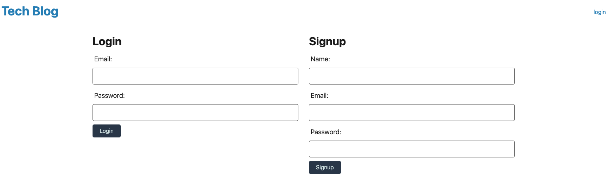

# Tech-Blog

## Description
To build a CMS-style blog site similar to a Wordpress site, where developers can publish their blog posts and comment on other developers’ posts as well. You’ll build this site completely from scratch and deploy it to Heroku. Your app will follow the MVC paradigm in its architectural structure, using Handlebars.js as the templating language, Sequelize as the ORM, and the express-session npm package for authentication.

## Table of Contents
* [Installation](#installation)
* [Usage](#usage)
* [Link](#link)
* [License](#license)

## Installation
- Express-handlebars
- MySQL2
- Sequelize
- dotenv
- bcrypt
- express-session
- connect-session-sequelize

## Usage
- Created function for signup and login

- Create a new post

- Review all posts

- Created logout function
## Link
[Github repository](https://github.com/Shok1to/Tech-Blog)

[Deploy page]()

## License

